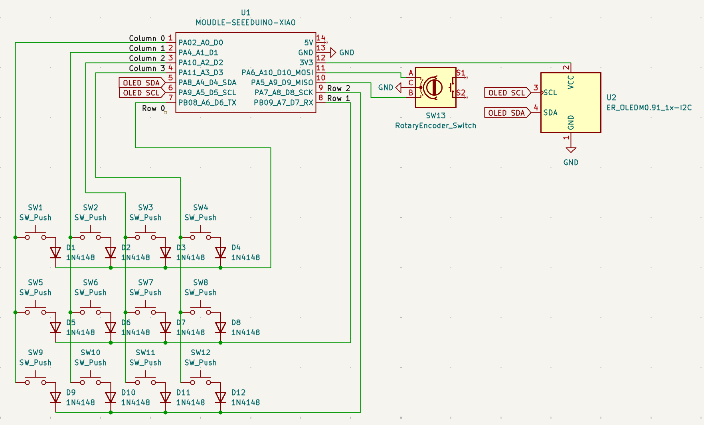
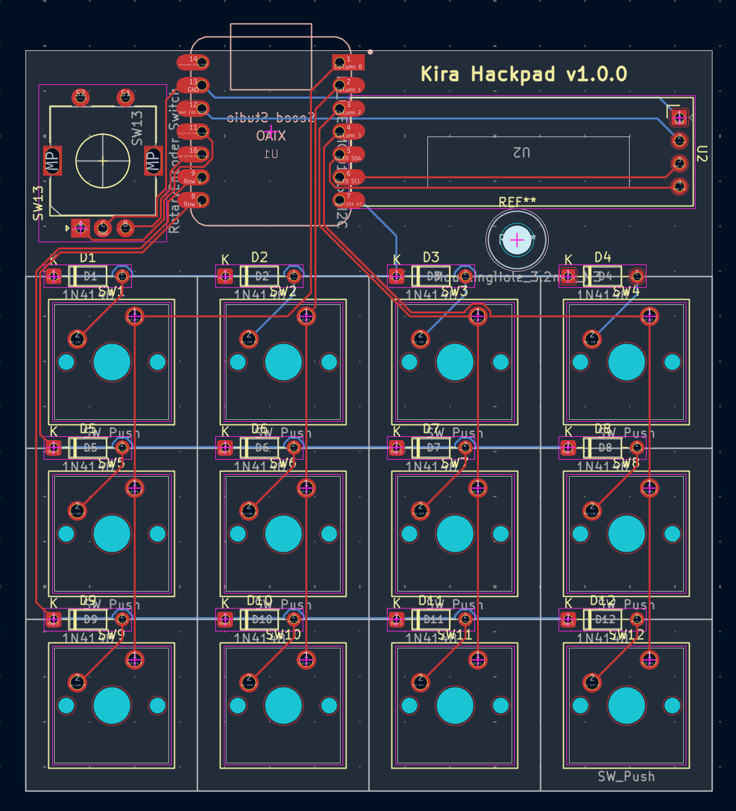
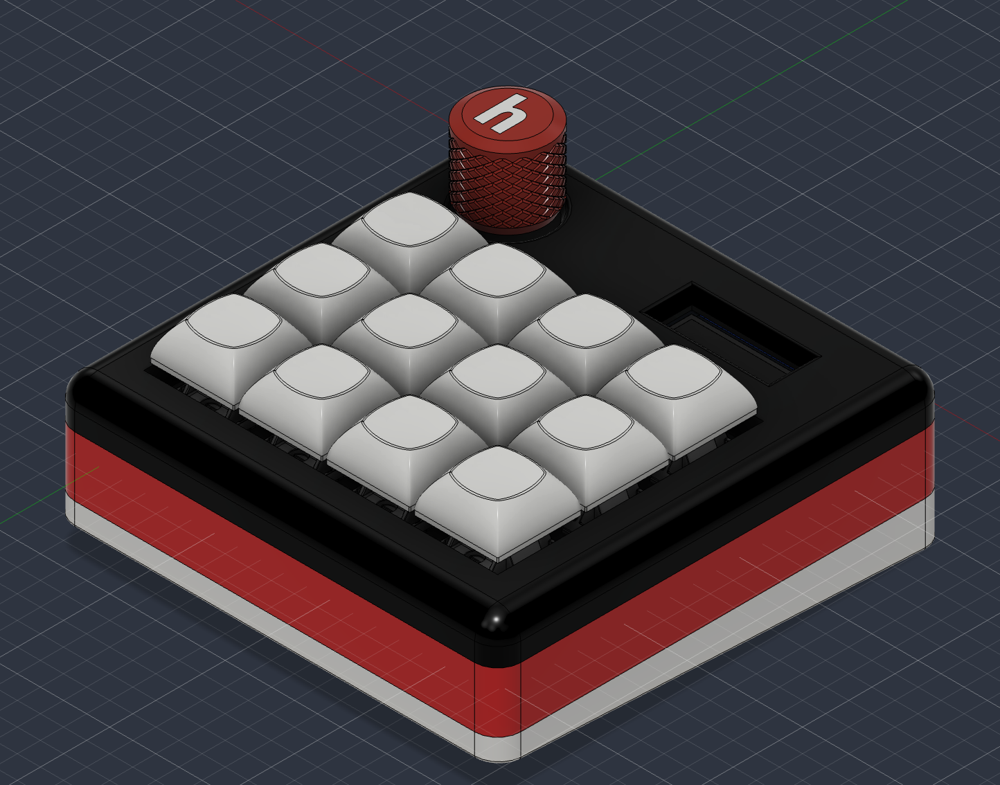

# Kira Hackpad

A 12-key custom macropad with a rotary encoder and a little OLED screen, built from scratch - PCB, case, and firmware.

## Features

- 12 keys in a 4x3 grid
- Rotary encoder for volume
- 0.91" OLED display for status
- Runs on a Seeed XIAO RP2040
- QMK firmware

## Hardware

- Controller: Seeed XIAO RP2040
- Switches: 12x Cherry MX
- Diodes: 12x 1N4148
- Encoder: EC11 rotary encoder
- Display: 0.91" SSD1306 OLED (128x32)

## PCB

Designed in KiCad. It's a simple 2-layer board - a 2x4 switch matrix with per-key diodes, XIOA footprint, encoder, and OLED. Source files are in ['pcb/'](pcb/) (schematic, layout, and STEP export).

## Case

Designed in Fusion 360, in three printed parts: the angle, the base where the PCB sits, and the top cover. They fits together using 5 M3 bolts and heatset inserts - 4 cor the case and one for the PCB. The design is in ['cad/'](cad/).

## Firmware

Written with QMK and lives in ['firmware/'](firmware/). The keys are laid out for editing + media shortcuts, the encoder controls volume, and OLED shows a status readout. A ready-to-flash `firmware.uf2` is in ['production/'](production/).

### Keymap

| | | |
|-|-|-|
| Undo | Redo  | Cut  | Prev |
| Copy | Paste | Save | Play |
| All  | Find  | Mute | Next |

Encoder: turn = Volume Down / Up

"Undo", "Redo", "Cut", "Prev", "Copy", "Paste", "Save", "Play", "Select All", and "Find" are sent as **Ctrl+key**, which works on Windows. On macOS remap them to `G(...)` (Cmd) in `keymaps/default/keymap.c`.

### Flash

To flash: put the XIAO RP2040 into bootloader mode (double-tap RESET or hold BOOT while plugging in). It appears as a USB drive - copy `firmware.utf2` onto it. The board reboots into the firmware.

### Customizing

- Keys - edit the `LAYOUT(...)` block in `keymaps/default/keymap.c`.
- Encoder - edit the `encoder_map` in the same file.
- OLED text - edit `oled_task_user()` in the same file.

## Built with

- KiCad (PCB)
- Fusion 360 (case)
- QMK (firmware)

## Bill of Materials

### Components

| Qty | Component                    | Notes                      |
| --: | ---------------------------- | -------------------------- |
|   1 | Seeed Studio XIAO RP2040     | Main microcontroller       |
|   1 | 0.91" SSD1306 OLED Display   | 128×32, I2C                |
|  12 | MX-style Mechanical Switches | Switches of choice         |
|  12 | Blank DSA Keycaps            | White                      |
|   4 | M3×16mm Screws               | Enclosure fasteners        |
|   1 | M3×12mm Screw                | Enclosure fastener         |
|   5 | M3×5×4mm Heatset Inserts     | Brass threaded inserts     |
|  12 | 1N4148 Diodes                | Through-hole matrix diodes |
|   1 | Case                         | Case (3 printed parts)     |

### Hack Club Grants

I used/received the following Hack Club grants during the project:

* **Hackpad Kit!** - Hackpad kit containing parts for the project
* **Printing Legion Grant** - $8 shipping credit for a part under 300g
* **Soldering Iron Grant** - $18 grant toward a soldering iron
* **Hackpad PCB Grant** - $10 JLCPCB credit for the Hackpad PCB

## Inspiration

It was was created using guide from Hack Club's Stardance program as a starting point. It was also inspired by [Orpheuspad](https://github.com/qcoral/orpheuspad) and the wider custom hackpad community. Thanks for sharing your bilds!

## Author

Made with ❤️ by [@kira-iovenko](https://github.com/kira-iovenko)
